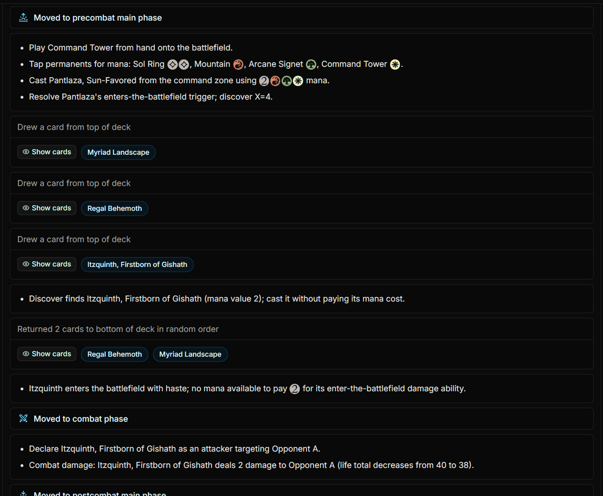

# MTG Auto Deck




## Setup

1. Copy the server example environment file:

   ```sh
   cp mtg-auto-deck-server/.env.example mtg-auto-deck-server/.env
   ```

2. Fill in the variables in `mtg-auto-deck-server/.env`.

   For user accounts, set `BETTER_AUTH_SECRET`, `BETTER_AUTH_URL`,
   `APP_PUBLIC_URL`, and the `SMTP_*` variables used for auth email.
   In local development, open the app at the same host configured in
   `APP_PUBLIC_URL` so auth cookies are sent consistently.
   The standalone `/mcp/simulation` server is test-only and is disabled by
   default; set `SIMULATION_MCP_SERVER_ENABLED=true` only when intentionally
   testing that endpoint.

3. Configure the frontend public URLs for each Vite mode.

   Use localhost for development:

   ```sh
   cp .env.example .env.development
   ```

   Create the production env file from the same example:

   ```sh
   cp .env.example .env.production
   ```

   Then update `.env.production` with your deployed API and app URLs:

   ```env
   VITE_API_BASE_URL=https://api.example.com
   VITE_APP_PUBLIC_URL=https://app.example.com
   ```

   Vite automatically loads `.env.development` for `npm run dev` and
   `.env.production` for `npm run build`. `VITE_*` values are exposed to the
   browser, so use them only for public configuration like app and API origins.

4. Install dependencies:

   ```sh
   npm install
   ```

## Running

Start the app and server in separate terminals:

```sh
npm run dev
```

```sh
npm run server:watch
```

Optionally start ngrok when using openai and locally running mcp server:

```sh
npm run ngrok
```

## Deploying the frontend to Cloudflare Workers

This deploys the Vite React frontend as Cloudflare Workers Static Assets. The
Node/Express server in `mtg-auto-deck-server` still needs to be hosted
separately or ported to a Worker-compatible API.

Before deploying, make sure the production frontend URLs are configured:

```env
VITE_API_BASE_URL=https://api.example.com
VITE_APP_PUBLIC_URL=https://app.example.com
```

For Cloudflare Git builds, set `VITE_API_BASE_URL` and `VITE_APP_PUBLIC_URL` as
build environment variables in the Cloudflare dashboard, since local
`.env.production` files are not committed.

Production domains should come from environment variables and deployment
configuration, not from application or server source code. On the hosted server,
set `BETTER_AUTH_URL` to the public API origin and `APP_PUBLIC_URL` to the
public React app origin. In local development, the example env files use
`http://localhost:3001` for the API and `http://localhost:5173` for the app.

Then deploy:

```sh
npm run deploy
```

To preview the Cloudflare Workers build locally:

```sh
npm run preview:cloudflare
```
